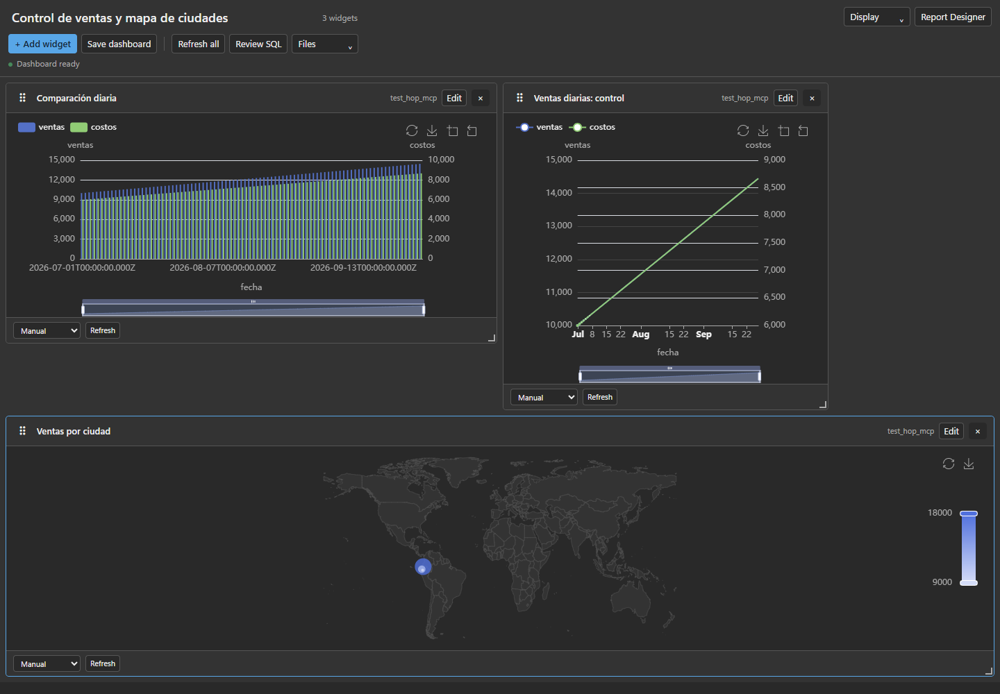
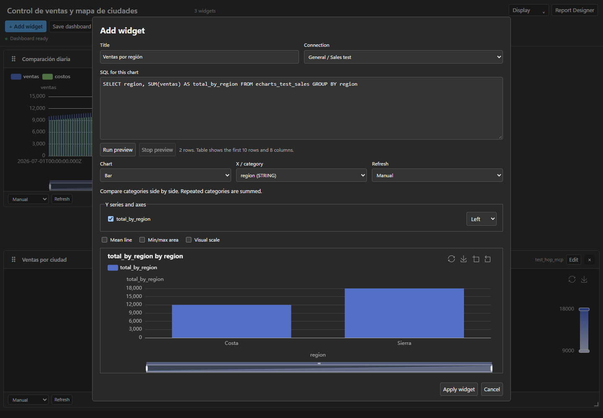
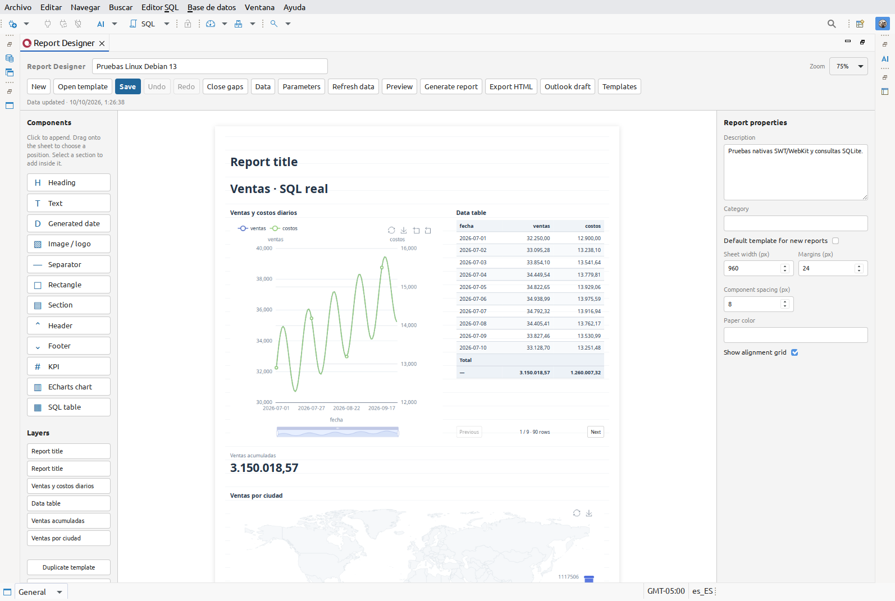
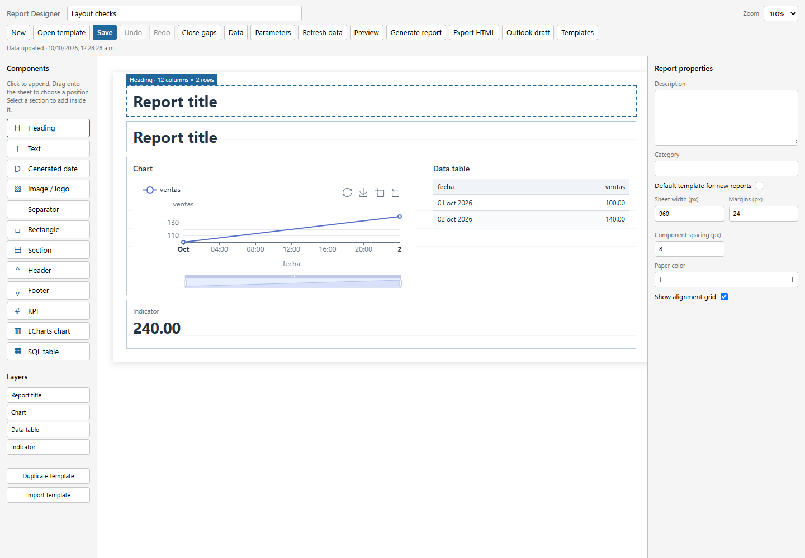
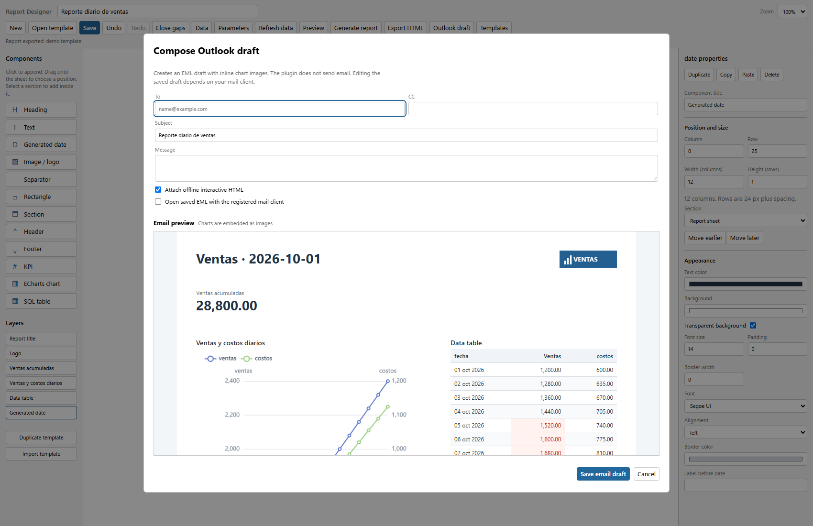

# DBeaver ECharts — 0.6.0 beta

Plugin independiente para **DBeaver Community**: convierte resultados SQL en gráficos,
dashboards y reportes visuales con Apache ECharts. Eclipse se necesita para desarrollar,
pero **no para instalar y utilizar el plugin**.

## Descargar e instalar

Descarga el ZIP P2 y su checksum en el [release 0.6.0 beta](https://github.com/michaaels/dbeaver_echart_plugin/releases/tag/v0.6.0-beta.1).

1. En DBeaver, abre **Help / Ayuda → Install New Software → Add → Archive**.
2. Selecciona `dbeaver-echarts-<version>.zip` sin descomprimirlo.
3. Marca **DBeaver ECharts Presentation**, completa la instalación y reinicia.
4. Ejecuta un `SELECT` y selecciona **ECharts** en las pestañas del resultado.
5. Para reportes, abre **Window → Show View → Other → ECharts → Report Designer**.

Target probado: **DBeaver Community 26.2.2, Windows y Linux x86_64**.
Es una **beta sin firma**, con certificación de drivers, clientes de correo y macOS pendiente.
Consulta la [guía de instalación](docs/P2-UPDATE-SITE.md), la
[matriz de compatibilidad](docs/COMPATIBILITY.md) y los [pendientes de producción](docs/PRODUCTION-READINESS.md).

## Funcionalidades en imágenes

Capturas reales del plugin con datos de ejemplo. La captura del diseñador en Linux
se tomó dentro de DBeaver; las demás muestran el frontend local durante sus pruebas.

### Dashboards y mapas

Combina gráficos y mapas; mueve los widgets desde la cabecera y cambia su tamaño
desde **cualquier borde o esquina**. Guarda posiciones, configuración y SQL como
JSON versionado y archivo `.sql` en `Dashboards/ECharts`.



### SQL independiente por gráfico

**Add widget** y **Edit** permiten elegir conexión, editar SQL y ejecutar **Run preview**.
Selecciona columnas, series y ejes antes de aplicar el gráfico. Cada widget tiene su
propia consulta y política de refresco; **Review SQL** revisa las consultas guardadas.



### Diseñador de reportes

Diseña una hoja con títulos, textos, imágenes, secciones, gráficos, KPIs y tablas SQL.
Configura propiedades, fuentes de datos y parámetros; guarda plantillas reutilizables
con su SQL. Las tablas admiten paginación, totales y formato condicional.



### Arrastre con reorganización previa

Al arrastrar un componente, la hoja muestra el espacio que ocupará y cómo se desplazarán
los demás elementos antes de soltarlo. Al eliminar componentes se recupera el espacio;
**Close gaps**, deshacer y rehacer ayudan a ajustar la distribución.



### Borrador de correo con vista previa

La vista previa aparece **debajo del formulario**. El EML incluye los gráficos como
imágenes CID y respeta la página y altura configuradas de las tablas, sin extenderlas
a toda la consulta. Puede adjuntar el HTML interactivo. **El plugin guarda el borrador;
no envía correo**. Su apertura y edición dependen del cliente instalado.



## Gráficos y exportación

- Líneas, áreas, barras verticales y horizontales, barras y áreas apiladas, dispersión,
  pastel, gauge, radar, heatmap, boxplot, treemap, funnel y mapa geográfico.
- Varias series, doble eje Y, escala visual, líneas y áreas de referencia.
- Tooltip, zoom, restauración y descarga PNG; renderizadores Canvas y SVG.
- Tema claro/oscuro sincronizado con DBeaver; filtros compartidos y drill-down en dashboards.
- Reportes HTML interactivos autocontenidos y HTML estático para correo.

ECharts, el mapa y los recursos del frontend se empaquetan localmente, sin CDN ni telemetría.
El HTML exportado permite consultar los datos incluidos; actualizar SQL requiere DBeaver.
Guías: [dashboards](docs/DASHBOARDS.md), [Report Designer](docs/REPORT-DESIGNER.md),
[cambios del release](CHANGELOG.md).

## Arquitectura y mantenimiento

Java 21 · Apache ECharts 6.1.0 · Eclipse PDE / SWT Browser.

```text
Resultados DBeaver / consultas aisladas
              ↓
DBeaverResultSetAdapter / DashboardQueryJob
              ↓
Snapshots JSON → EChartsPresentation → frontend local → ECharts
```

- `DashboardQueryJob` ejecuta consultas revisadas en contextos independientes;
  `DashboardQueryApproval` liga la aprobación de sesión al SQL y la conexión.
- `EChartsPresentation` mantiene el ciclo de vida SWT y el límite del hilo UI.
- `analytics.js` construye opciones; `dashboard.js` y `widget-editor.js` separan modelo y edición.
- `ReportFiles` valida plantillas; `DocumentFiles` centraliza escritura atómica por archivo
  y protección de los acompañantes SQL. El par JSON/SQL no es una transacción.
- Los [módulos de reportes](docs/REPORT-DESIGNER.md) separan plantilla, datos, render y correo.

## Validar y desarrollar

Windows:

```powershell
.\scripts\validate.ps1 -DBeaverPlugins C:\dbeaver\plugins
```

Linux:

```bash
DBEAVER_PLUGINS=/opt/dbeaver/plugins bash scripts/validate.sh
```

La validación comprueba fuentes Java/JavaScript, formatos, controles de consultas,
recursos y contratos del plugin. GitHub Actions construye el P2 y prueba instalación,
actualización, desinstalación y reinstalación en Windows; también instala y prueba
el mismo paquete en Linux con Chromium y WebKit.

Para una vista local con datos de ejemplo: `node scripts/preview.js`, luego abre
`http://127.0.0.1:8765`. Para Eclipse, importa los proyectos de `plugins/`, `features/`
y `sites/` y usa la instalación de DBeaver como target.
Consulta [desarrollo](docs/DEVELOPMENT.md), [build](docs/BUILD.md) y
[empaquetado P2](docs/P2-UPDATE-SITE.md).

## Licencias

Los recursos de terceros tienen versiones y hashes fijados. Licencias, avisos y
procedencia están en [third-party/](plugins/org.example.dbeaver.echarts/third-party/); los scripts de actualización
están en `scripts/`.
